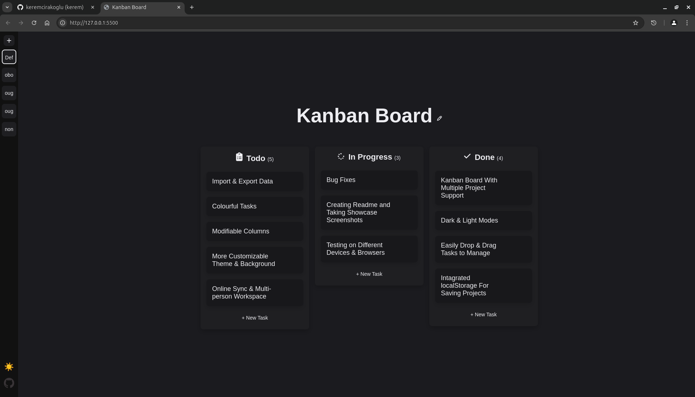

# Kanban Board

A lightweight, browser-based Kanban board application built with vanilla JavaScript. Manage your tasks with a clean, intuitive interface and persistent storage.

## 🚀 Live Demo

Visit the live application: [https://keremcirakoglu.github.io/kanban-board/)

## ✨ Features

- **Simple Task Management:** Create, edit, and delete tasks easily
- **Drag & Drop:** Drag-and-drop interface for task management `Credits: Tutorial - https://youtu.be/ecKw7FfikwI?si=m8cg_XwoXV5fSTTJ`
- **Multiple Projects:** Create and manage separate project workspaces
- **Dark/Light Theme:** Toggle between dark and light modes
- **Persistent Storage:** All data is saved locally in your browser
- **Responsive Design:** Works on both desktop and mobile devices
- **No Dependencies:** Built with pure JavaScript, HTML, and CSS

## 💻 Usage

1. **Managing Tasks:**
   - Click "+ New Task" to add tasks
   - Drag tasks between Todo, In Progress, and Done columns
   - Click the edit icon to modify tasks
   - Click the delete icon to remove tasks

2. **Projects:**
   - Use the sidebar '+' button to create new projects
   - Click project buttons to switch between workspaces
   - Each project has its own task list and name

3. **Theme:**
   - Toggle between light/dark themes using the theme button

   

## 🤝 Contributing

Contributions are welcome! Please feel free to submit a Pull Request. For major changes, please open an issue first to discuss what you would like to change.

1. Fork the Project
2. Create your Feature Branch (`git checkout -b feature/AmazingFeature`)
3. Commit your Changes (`git commit -m 'Add some AmazingFeature'`)
4. Push to the Branch (`git push origin feature/AmazingFeature`)
5. Open a Pull Request

## 🗺️ Roadmap

### ✅ Short-Term Goals
- [ ] Theme customization support  
  `e.g. color schemes, font settings, layout options`
- [ ] Data import/export  
  `save and load boards as JSON`

### 💡 Long-Term Vision
- [ ] Desktop application version  
  `built with Electron or a similar framework`
- [ ] Cloud sync and user accounts  
  `access your boards across devices`

## 📝 License

This project is licensed under the MIT License - see the [LICENSE](LICENSE) file for details.
